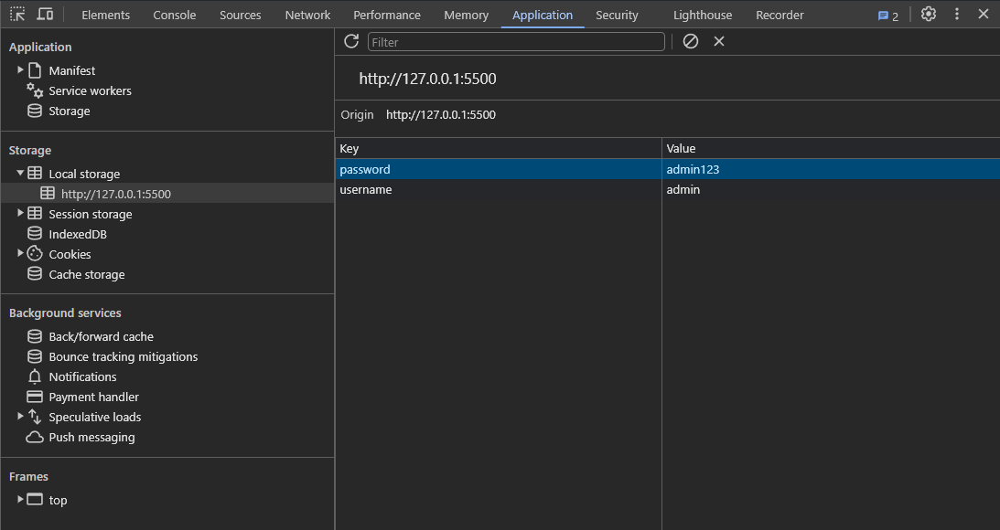

# Vulnerable Web Application

The following code snipped, which represents a basic authentication form, has several vulnerabilities that need to be addressed as soon as possible.

## Vulnerabilities

### Local Storage - Credentials disclosure

Looking at the code, we see that the application relies on the browser's local storage to save the user credentials. This is bad practice because event after closing the server, the client's browser still remembers the credentials, which then can be used by treat actors to perform malicious activities.

```js
function login() {
    //const username = document.getElementById('username').value;
    //const password = document.getElementById('password').value;
    localStorage.setItem('username', username); 
    localStorage.setItem('password', password);
    //if (username === 'admin' && password === 'admin123') {
    //    alert('Login successful!');
    //} else {
    //    alert('Invalid credentials!');
    //}
    //document.body.innerHTML += `<p>Welcome, ${username}!</p>`;
}
```


**Solution**: We can directly remove these two lines of code, because we usually don't want to store sensitive data, but if there is a particular reason to do so, we can rely on session storage instead, which mantains the information only during that particular session. When the user close the browser, all the information will be deleted.

```js
function login() {
    const username = document.getElementById('username').value;
    const password = document.getElementById('password').value;
    sessionStorage.setItem('username', username); 
    sessionStorage.setItem('password', password);
    if (username === 'admin' && password === 'admin123') {
       alert('Login successful!');
    } else {
       alert('Invalid credentials!');
    }
    document.body.innerHTML += `<p>Welcome, ${username}!</p>`;
}
```